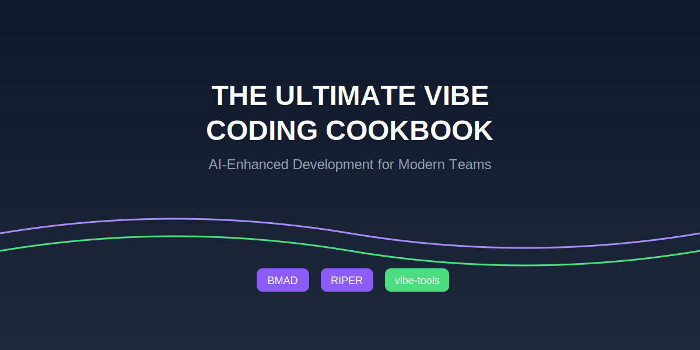

# The Ultimate Vibe Coding Guide 



## A Comprehensive Guide for AI-Assisted Development Teams

This guide provides everything you need to get started with AI-assisted development, including environment setup, project workflows, and best practices.

## 📚 Table of Contents

1. [Introduction to Vibe Coding](#introduction-to-vibe-coding)
2. [Getting Started](#getting-started)
   - [Environment Setup](#environment-setup)
   - [Setup Scripts](#setup-scripts)
3. [Core Frameworks](#core-frameworks)
4. [Project Workflow](#project-workflow)
5. [Best Practices](#best-practices)
6. [Troubleshooting](#troubleshooting)
7. [Resources](#resources)
8. [Folder Structure](#folder-structure-overview)

---

## Introduction to Vibe Coding

Vibe coding is a development approach where developers collaborate with AI tools to create software more efficiently. Rather than writing every line of code manually, developers describe what they want to build in natural language, and AI tools help generate, refine, and implement the code.

Our integrated approach to vibe coding combines:

- **Structured Methodologies** (BMAD Method and CursorRIPER)
- **Cross-Platform Tools** (vibe-tools)
- **Collaborative Workflows** (Clear checkpoints and documentation)

---

## Getting Started

### Environment Setup

We provide two setup scripts to help you get started quickly:

1. **Development Environment Setup**: Prepares a full AI-enhanced development workspace.
2. **Vibe Coding Cookbook Setup**: Bootstraps this repository for documentation and team use.

### Setup Scripts

#### Option 1: Complete Development Environment

**Installation Steps:**

```bash
# Download the development environment setup script
curl -O https://raw.githubusercontent.com/jvalenzano/vibe-coding-cookbook/main/scripts/setup-dev-environment.sh

# Make it executable
chmod +x setup-dev-environment.sh

# Run the script
./setup-dev-environment.sh
```

**Creates:**
- Directory structure for AI tools, projects, and templates
- Clones BMAD Method, CursorRIPER, and vibe-tools repositories
- Configures vibe-tools globally
- Initializes sample projects

#### Option 2: Cookbook Repository Setup

**Installation Steps:**

```bash
# Download the vibe cookbook setup script
curl -O https://raw.githubusercontent.com/jvalenzano/vibe-coding-cookbook/main/scripts/setup-vibe-cookbook.sh

# Make it executable
chmod +x setup-vibe-cookbook.sh

# Run the script
./setup-vibe-cookbook.sh vibe-coding-cookbook
```

**Creates:**
- Structured documentation repository
- Examples, templates, and image directories
- GitHub-ready configuration

---

## Core Frameworks

### vibe-tools

A CLI utility for enhancing AI-assisted development.

| Command | Purpose | Example |
|---------|---------|---------|
| `vibe-tools ask` | Query AI models directly | `vibe-tools ask "How do I optimize this React component?"` |
| `vibe-tools web` | Web-aware AI assistance | `vibe-tools web "Security practices for Express apps"` |
| `vibe-tools repo` | Context-aware repo analysis | `vibe-tools repo "Explain our authentication flow"` |
| `vibe-tools plan` | Implementation planning | `vibe-tools plan "Add user profile feature"` |
| `vibe-tools doc` | Documentation generation | `vibe-tools doc --save-to=api-docs.md` |

### BMAD Method

Breakthrough Method for Agile AI-Driven Development with specialized AI personas.

| Persona | Role | When to Use |
|---------|------|-------------|
| Business Analyst | Gather requirements | Project initiation |
| Product Manager | Define features | Feature planning |
| UX Designer | Design interfaces | Before frontend work |
| Software Architect | Design systems | Before implementation |
| Engineer | Implement features | During development |
| QA Engineer | Validate implementation | After implementation |

### CursorRIPER Framework

Provides a five-mode operational structure:

| Mode | Purpose | Example Prompt |
|------|---------|----------------|
| Research | Gather context | "Research best practices for API security" |
| Innovate | Brainstorm solutions | "Innovate approaches for user authentication" |
| Plan | Structure implementation | "Plan our task management app" |
| Execute | Write/refine code | "Implement the login feature" |
| Review | Test and improve | "Review for security vulnerabilities" |

---

## Project Workflow

Follow this integrated workflow:

1. **Initialize Project**
   ```bash
   ~/Development/vibe-coding-cookbook/scripts/init-project.sh my-project webapp
   ```

2. **Gather Requirements** (BMAD Business Analyst)
3. **Design Architecture** (BMAD Software Architect)
4. **Break Down Tasks** (CursorRIPER Plan mode)
5. **Implement Features** (CursorRIPER Execute mode)
6. **Review and Document** (CursorRIPER Review mode)

---

## Best Practices

### Effective Prompting (STAR Framework)
- **S**ituation: Provide background
- **T**ask: State what you need
- **A**ction: Suggest an approach
- **R**esult: Define expected outcome

### Guardrails
- Always review AI output
- Test thoroughly
- Prioritize security
- Document deviations

### Standard Project Structure

```
project-root/
└── docs/
    ├── requirements/
    ├── architecture/
    ├── tasks/
    └── review/
```

---

## Troubleshooting

| Issue | Solution |
|-------|----------|
| AI generates outdated code | Provide more environment context |
| AI misunderstands structure | Use `vibe-tools repo` for context-aware queries |
| Inconsistent results across team | Standardize prompt templates |

---

## Resources

- **Scripts**: `~/Development/vibe-coding-cookbook/scripts/`
- **Cookbook**: `~/Development/vibe-coding-cookbook/cookbook.md`
- **Shared Prompts**: `~/Development/vibe-coding-cookbook/Shared/prompts/`
- **External Links**:
  - [BMAD Method](https://github.com/bmadcode/BMAD-METHOD)
  - [CursorRIPER](https://github.com/johnpeterman72/CursorRIPER)
  - [vibe-tools](https://github.com/eastlondoner/cursor-tools)

---

## Folder Structure Overview

The `vibe-coding-cookbook` repository is organized into key functional areas:

```
vibe-coding-cookbook/
├── AI-Tools/               # Included AI frameworks: BMAD, CursorRIPER, vibe-tools
├── docs/                   # Getting started guides, techniques
├── examples/               # Example rules, starter scripts
├── images/                 # Diagrams, screenshots, and visuals
├── scripts/                # Setup scripts for projects and environments
├── Shared/                 # Prompt libraries, style guides, and shared resources
├── templates/              # Unified template library
│   ├── projects/           # Full project blueprints (Node, React, Fullstack)
│   └── snippets/           # Reusable code prompts/snippets (Cursor, Replit, Windsurf)
├── README.md               # Entry point and overview
├── cookbook.md             # Main cookbook content
└── .gitignore, LICENSE     # Standard project configs
```

*This guide is maintained by the AI Tools Team. Last updated: April 2025.*

