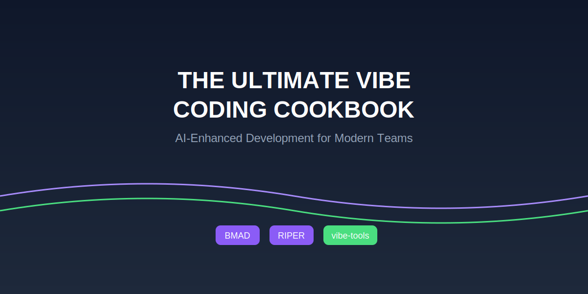

# The Ultimate Vibe Coding Cookbook
## A Comprehensive Guide for AI-Assisted Development Teams



## Table of Contents

1. [Introduction to Vibe Coding](#introduction-to-vibe-coding)
2. [Setting Up Your Environment](#setting-up-your-environment)
3. [Our Team Workflow](#our-team-workflow)
4. [Core Tools and Frameworks](#core-tools-and-frameworks)
5. [Project Lifecycle Guide](#project-lifecycle-guide)
6. [Best Practices](#best-practices)
7. [Troubleshooting](#troubleshooting)
8. [Advanced Techniques](#advanced-techniques)
9. [Team Resources](#team-resources)
10. [Glossary](#glossary)

---

## Introduction to Vibe Coding

### What is Vibe Coding?

Vibe coding is a development approach where developers collaborate with AI tools to create software more efficiently. Rather than writing every line of code manually, developers describe what they want to build in natural language, and AI tools help generate, refine, and implement the code.

### How Our Team Uses Vibe Coding

Our team has adopted an integrated approach to vibe coding that combines:

1. **Structured Methodologies** - BMAD Method and CursorRIPER for organized workflows
2. **Cross-Platform Tools** - vibe-tools for consistency across different IDE environments
3. **Collaborative Workflows** - Clear checkpoints and documentation to ensure team alignment

### Benefits You'll Experience

- **Faster Development** - Reduce time spent on repetitive coding tasks
- **Increased Focus** - Concentrate on high-level design and business logic
- **Better Documentation** - AI assistance helps maintain comprehensive documentation
- **Reduced Debugging** - Structured approaches minimize errors and inconsistencies
- **Seamless Collaboration** - Common frameworks facilitate team collaboration

---

## Setting Up Your Environment

### Directory Structure

Our team follows a standardized directory structure to ensure consistency:

```
~/Development/
│
├── AI-Tools/                  # Central location for AI frameworks
│   ├── vibe-tools/            # vibe-tools CLI
│   ├── BMAD-METHOD/           # BMAD framework reference
│   ├── CursorRIPER/           # CursorRIPER framework reference
│   └── custom-rules/          # Custom rules for different environments
│
├── Projects/                  # Your project workspaces
├── Templates/                 # Reusable project templates
└── Shared/                    # Shared resources across projects
```

### Initial Setup Checklist

- [ ] Install core IDE tools (Cursor, Windsurf, or Replit based on your role)
- [ ] Set up the standard directory structure
- [ ] Clone reference repositories
- [ ] Configure global AI settings
- [ ] Install vibe-tools CLI
- [ ] Set up API keys (request from team lead)

### First-Time Setup Commands

```bash
# Create directory structure
mkdir -p ~/Development/{AI-Tools,Projects,Templates,Shared}
mkdir -p ~/Development/AI-Tools/custom-rules/{cursor,windsurf,shared}

# Install vibe-tools
npm install -g @eastlondoner/vibe-tools

# Clone reference frameworks
cd ~/Development/AI-Tools
git clone https://github.com/bmadcode/BMAD-METHOD.git
git clone https://github.com/johnpeterman72/CursorRIPER.git
git clone https://github.com/eastlondoner/cursor-tools.git vibe-tools

# Run vibe-tools installation
vibe-tools install
```

### Environment Configuration

<details>
<summary>Cursor Configuration</summary>

For Cursor, create a `.cursor/rules` directory in your project with `.mdc` files:

```
.cursor/
└── rules/
    ├── bmad.mdc    # BMAD method instructions
    ├── riper.mdc   # RIPER framework instructions
    └── vibe.mdc    # vibe-tools integration
```
</details>

<details>
<summary>Windsurf Configuration</summary>

For Windsurf, create a `.windsurfrules` file in your project:

```
You are working with a project that follows the BMAD method and RIPER framework.
Use vibe-tools when appropriate for enhanced capabilities.
...
```
</details>

<details>
<summary>Replit Configuration</summary>

For Replit, add a `.replit` file with appropriate configurations and a `.replit/instructions.md` file with AI guidelines.
</details>

### Testing Your Setup

Run the following command to verify your setup:

```bash
vibe-tools ask "Confirm that vibe-tools is properly installed and configured."
```

You should see a response indicating successful installation.

---

## Our Team Workflow

Our team follows an integrated workflow that combines elements from BMAD Method, CursorRIPER, and vibe-tools.

### Workflow Diagram

```
┌───────────────┐     ┌───────────────┐     ┌───────────────┐
│  Requirements │────▶│  Architecture │────▶│  Task Planning│
│  (BMAD BA/PM) │     │  (BMAD Arch)  │     │  (RIPER Plan) │
└───────────────┘     └───────────────┘     └───────────────┘
        │                     │                     │
        ▼                     ▼                     ▼
┌───────────────┐     ┌───────────────┐     ┌───────────────┐
│Documentation  │◀────│Implementation │◀────│    Testing    │
│(RIPER Review) │     │(RIPER Execute)│     │(RIPER Review) │
└───────────────┘     └───────────────┘     └───────────────┘
```

### Key Workflow Phases

#### 1. Requirements Gathering
- **Who**: Product Owner with Business Analyst AI persona
- **Tools**: Cursor + BMAD prompts
- **Outputs**: `requirements.md` in project docs directory
- **Checkpoint**: Team review of requirements

#### 2. Architecture Design
- **Who**: Tech Lead with Software Architect AI persona
- **Tools**: vibe-tools repo command
- **Outputs**: Architecture diagrams and specifications
- **Checkpoint**: Architecture review meeting

#### 3. Task Planning
- **Who**: Tech Lead and Developers
- **Tools**: vibe-tools plan command
- **Outputs**: Task breakdown with clear ownership
- **Checkpoint**: Sprint planning and task assignment

#### 4. Implementation
- **Who**: Developers
- **Tools**: Cursor/Windsurf + vibe-tools
- **Outputs**: Code and unit tests
- **Checkpoint**: Daily standups and code reviews

#### 5. Testing
- **Who**: QA and Developers
- **Tools**: vibe-tools for test generation
- **Outputs**: Test reports and bug tracking
- **Checkpoint**: QA sign-off

#### 6. Documentation
- **Who**: Developers with Technical Writer AI persona
- **Tools**: vibe-tools doc command
- **Outputs**: API docs, user guides, etc.
- **Checkpoint**: Documentation review

### Communication Touchpoints

- **Daily Standups**: Quick updates on AI-assisted work
- **Bi-Weekly Retrospectives**: Share effective AI prompts and patterns
- **Monthly Workshops**: Train on new AI techniques and tools

---

## Core Tools and Frameworks

### vibe-tools

vibe-tools is our central CLI that enhances AI capabilities across different environments.

#### Key Commands

| Command | Purpose | Example |
|---------|---------|---------|
| `vibe-tools ask` | Query AI models directly | `vibe-tools ask "How do I optimize this React component?"` |
| `vibe-tools web` | Web-aware AI assistance | `vibe-tools web "Latest security practices for Express apps"` |
| `vibe-tools repo` | Codebase-aware assistance | `vibe-tools repo "Explain our authentication flow"` |
| `vibe-tools plan` | Implementation planning | `vibe-tools plan "Add user profile feature"` |
| `vibe-tools doc` | Documentation generation | `vibe-tools doc --save-to=api-docs.md` |

#### Command Options

Each command supports various options. Common ones include:

- `--provider=<provider>`: Specify AI provider (openai, anthropic, gemini)
- `--model=<model>`: Specify model to use
- `--save-to=<file>`: Save output to a file
- `--from-github=<repo>`: Use a GitHub repository as source

### BMAD Method

The BMAD Method (Breakthrough Method for Agile AI Driven Development) provides a structured approach using specialized AI personas.

#### Key Personas

| Persona | Role | When to Use |
|---------|------|-------------|
| Business Analyst | Gather requirements | Project initiation |
| Product Manager | Create specifications | Feature planning |
| UX Designer | Design user interfaces | Before frontend work |
| Software Architect | Design technical architecture | Before implementation |
| Engineer | Implement features | During development |
| QA Engineer | Test and validate | After implementation |

#### Using BMAD Effectively

1. **Stay in Character**: When using a persona, maintain its perspective throughout
2. **Progressive Refinement**: Move sequentially through personas
3. **Document Transitions**: Clearly mark when switching personas
4. **Reference Previous Outputs**: Each persona should build on previous work

### CursorRIPER Framework

CursorRIPER provides a structured workflow with five operational modes.

#### RIPER Modes

| Mode | Purpose | Example Prompt |
|------|---------|----------------|
| Research | Gather information and context | "Research best practices for API security in Node.js" |
| Innovate | Brainstorm solutions | "Innovate different approaches for implementing user authentication" |
| Plan | Break down implementation | "Plan the implementation of the user profile feature" |
| Execute | Write and refine code | "Execute the plan for implementing the login feature" |
| Review | Test and improve | "Review the implementation for security vulnerabilities" |

#### RIPER Workflows

The modes are designed to be used sequentially but can be revisited as needed:

```
Research → Innovate → Plan → Execute → Review
         ↑                               |
         └───────────────────────────────┘
```

---

## Project Lifecycle Guide

### Starting a New Project

1. **Initialize the project structure**:
   ```bash
   ~/Development/AI-Tools/init-project.sh my-project-name
   ```

2. **Set up requirements**:
   ```bash
   cd ~/Development/Projects/my-project-name
   vibe-tools ask "Act as a Business Analyst. Help me gather requirements for a project that..." > docs/requirements/requirements.md
   ```

3. **Create architecture design**:
   ```bash
   vibe-tools repo "Act as a Software Architect. Design an architecture for the project based on these requirements: $(cat docs/requirements/requirements.md)" > docs/architecture/architecture.md
   ```

4. **Plan implementation**:
   ```bash
   vibe-tools plan "Break down the implementation of this project into specific tasks" > docs/tasks/task_breakdown.md
   ```

### Working on Features

1. **Select a task from the breakdown**
2. **Research phase**:
   ```bash
   vibe-tools web "Research best approaches for implementing [feature]"
   ```

3. **Implementation**:
   Open Cursor/Windsurf and use:
   ```
   Act as an Engineer in RIPER Execute mode. Help me implement [task] according to our architecture design.
   ```

4. **Review and refine**:
   ```
   Act as a QA Engineer in RIPER Review mode. Review this implementation for issues and suggest improvements.
   ```

### Code Review Process

1. **Prepare code for review**:
   ```bash
   vibe-tools repo "Summarize the changes made in [feature] implementation for code review" > docs/reviews/feature_summary.md
   ```

2. **Self-review with AI**:
   ```
   Act as a Code Reviewer. Review this implementation for code quality, adherence to best practices, and potential issues.
   ```

3. **Update based on feedback**
4. **Submit for team review**

### Documentation

1. **Generate API documentation**:
   ```bash
   vibe-tools doc --save-to=docs/api_docs.md
   ```

2. **Create user guides**:
   ```bash
   vibe-tools ask "Create a user guide for the [feature] we implemented" > docs/user_guides/feature_guide.md
   ```

3. **Update README**:
   ```
   Help me update the README.md file to include information about the new feature.
   ```

### Deployment

1. **Prepare deployment configuration**:
   ```
   Act as a DevOps Engineer. Help me create deployment configuration for [platform].
   ```

2. **Generate release notes**:
   ```bash
   vibe-tools repo "Generate release notes for version X.Y.Z based on the changes since the last version" > docs/releases/vX.Y.Z.md
   ```

3. **Deploy and verify**

---

## Best Practices

### Effective Prompting

#### The STAR Prompting Framework

- **S**ituation: Provide context and background
- **T**ask: Clearly state what you need
- **A**ction: Specify the approach if you have one in mind
- **R**esult: Describe the expected outcome

#### Example STAR Prompt

```
Situation: We have a React application that needs to implement user authentication.
Task: Help me implement JWT-based authentication.
Action: I'd like to use React Context for state management and axios for API calls.
Result: I need a complete authentication system with login, logout, and protected routes.
```

### Guardrails for AI-Generated Code

1. **Never blindly accept code**: Always review before applying
2. **Test thoroughly**: AI may miss edge cases
3. **Security-first mindset**: Verify security practices
4. **Maintain consistency**: Ensure code matches existing patterns
5. **Document deviations**: Note when you modify AI suggestions

### Collaboration Etiquette

1. **Share effective prompts** in the team knowledge base
2. **Document AI-assisted work** in commit messages
3. **Be transparent** about AI usage in code reviews
4. **Respect API limits** by optimizing prompt usage
5. **Contribute improvements** to shared rule files

### Maintaining Code Quality

| Aspect | Best Practice | Example |
|--------|--------------|---------|
| **Readability** | Ask AI to comment complex sections | "Add detailed comments to this complex algorithm" |
| **Maintainability** | Request modular designs | "Refactor this into smaller, reusable functions" |
| **Performance** | Ask for optimization | "Optimize this database query for better performance" |
| **Security** | Request security reviews | "Review this code for security vulnerabilities" |
| **Testing** | Generate comprehensive tests | "Create unit tests covering all edge cases" |

---

## Troubleshooting

### Common Issues and Solutions

<details>
<summary>AI generates incorrect or outdated code</summary>

**Solution**: Provide more context about your specific environment and dependencies. Include version information in your prompts.

**Example prompt**: "Help me implement user authentication using React 18.2.0 and Express 4.18.2 with modern best practices from 2025."
</details>

<details>
<summary>AI misunderstands project structure</summary>

**Solution**: Use vibe-tools repo command which provides better context awareness.

**Example**:
```bash
vibe-tools repo "Given our project structure, explain how the authentication flow works"
```
</details>

<details>
<summary>Inconsistent results across team members</summary>

**Solution**: Standardize prompts and use shared rule files. Create template prompts in the Shared directory.

**Example**: Create `~/Development/Shared/prompts/auth-implementation.txt` with standardized prompts.
</details>

<details>
<summary>AI tool rate limiting</summary>

**Solution**: Implement request batching and caching. Consider upgrading API plans for team usage.

**Example**: Use `vibe-tools ask --save-to=cache/response.md` to save results for reuse.
</details>

### When to Ask for Help

1. **Complex Architectural Decisions**: Consult with Tech Lead
2. **Security-Critical Components**: Involve Security Team
3. **Persistently Incorrect AI Outputs**: Report to AI Tools Manager
4. **API Access Issues**: Contact Operations Team

### Escalation Path

1. Team documentation and knowledge base
2. Team chat channel (#vibe-coding-help)
3. Weekly tech support office hours
4. Tech Lead or AI Tools Manager

---

## Advanced Techniques

### Custom Rule Creation

Create specialized rule files for different project types:

```bash
# For a React project
cat > ~/Development/Templates/react-app/.cursor/rules/react.mdc << 'EOL'
---
name: React Best Practices
description: Guidelines for React development
---

When writing React code, follow these best practices:
- Use functional components with hooks instead of class components
- Follow the React component lifecycle correctly
- Use proper state management techniques
- Implement error boundaries for robust error handling
- Create small, reusable components
EOL
```

### Workflow Automation

Create shell scripts to automate common workflows:

```bash
#!/bin/bash
# new-feature.sh - Automate new feature creation

FEATURE_NAME=$1
PROJECT_DIR=$(pwd)

# Create feature documentation
mkdir -p docs/features/$FEATURE_NAME
vibe-tools ask "Create a feature specification for $FEATURE_NAME based on our project requirements" > docs/features/$FEATURE_NAME/spec.md

# Generate implementation plan
vibe-tools plan "Create an implementation plan for $FEATURE_NAME based on $(cat docs/features/$FEATURE_NAME/spec.md)" > docs/features/$FEATURE_NAME/plan.md

# Set up feature branch
git checkout -b feature/$FEATURE_NAME

echo "Feature $FEATURE_NAME initialized. See docs/features/$FEATURE_NAME for details."
```

### Integration with CI/CD

Add vibe-tools to your CI pipeline for automated documentation and testing:

```yaml
# .github/workflows/vibe-docs.yml
name: Update Documentation

on:
  push:
    branches: [ main ]

jobs:
  update-docs:
    runs-on: ubuntu-latest
    steps:
      - uses: actions/checkout@v3
      - uses: actions/setup-node@v3
        with:
          node-version: '18'
      - run: npm install -g @eastlondoner/vibe-tools
      - run: vibe-tools doc --save-to=docs/api_documentation.md
      - name: Commit updated documentation
        uses: stefanzweifel/git-auto-commit-action@v4
        with:
          commit_message: "Auto-update API documentation"
          file_pattern: docs/api_documentation.md
```

### Multi-Model Strategy

Different AI models excel at different tasks. Use this reference to choose the right model:

| Task | Recommended Model | Why |
|------|------------------|-----|
| Code generation | Claude 3.7 Sonnet | Excellent code quality with context understanding |
| Debugging | GPT-4o | Strong at identifying logical errors |
| Planning | Gemini Pro | Good at breaking down complex tasks |
| UI design | Claude 3 Opus | Better at understanding design requirements |
| Documentation | Claude 3.5 Sonnet | Produces clearer, more concise documentation |

---

## Team Resources

### Knowledge Base

- Team Wiki: [internal-link-to-wiki]
- Shared Prompts Repository: `~/Development/Shared/prompts/`
- Example Projects: `~/Development/Templates/`

### Learning Resources

- Weekly Tech Talks (Tuesdays at 2 PM)
- Monthly AI Tools Workshop (First Friday)
- Internal Learning Path: [internal-link-to-learning-path]

### Support Channels

- Slack: #vibe-coding-help
- Office Hours: Wednesdays 10 AM - 12 PM
- AI Tools Manager: [contact-info]

### API Keys and Access

Contact the AI Tools Manager for access to:
- OpenAI API keys
- Anthropic API access
- Google AI credentials
- Perplexity API access

---

## Glossary

| Term | Definition |
|------|------------|
| **Vibe Coding** | Coding approach collaborating with AI to write code via natural language |
| **BMAD Method** | Breakthrough Method for Agile AI Driven Development |
| **CursorRIPER** | Framework with five modes: Research, Innovate, Plan, Execute, Review |
| **vibe-tools** | CLI tool enabling AI teamwork across different environments |
| **Prompt Engineering** | Crafting effective instructions for AI models |
| **AI Persona** | Role-specific AI character with specialized knowledge and abilities |
| **Context Window** | The amount of text an AI model can consider at once |
| **Hallucination** | When AI generates incorrect information confidently |
| **RAG** | Retrieval-Augmented Generation for improved context awareness |
| **Fine-tuning** | Customizing AI models for specific domains or tasks |

---

## Appendix

### Example Prompts Library

<details>
<summary>Project Initialization</summary>

```
Act as a Business Analyst following the BMAD method. I need to create a new [type] application that will [main purpose]. The key requirements are:
1. [requirement 1]
2. [requirement 2]
3. [requirement 3]

Help me create a comprehensive business requirements document including success criteria, user personas, and key user journeys.
```
</details>

<details>
<summary>Architecture Design</summary>

```
Act as a Software Architect following the BMAD method. Based on these requirements:

[paste requirements]

Design a scalable, maintainable architecture for this system. Include:
1. Overall architecture diagram (describe components)
2. Technology stack recommendations with justifications
3. Data models and relationships
4. API design patterns
5. Security considerations
```
</details>

<details>
<summary>Task Implementation</summary>

```
Act as an Engineer in RIPER Execute mode. I need to implement [feature] according to this specification:

[paste specification]

Our project uses [technologies] and follows these patterns:
[paste relevant patterns]

Help me implement this feature with high-quality code, tests, and inline documentation.
```
</details>

### Team-Specific Guidelines

(This section should be customized for your team's specific needs, standards, and practices.)

---

*This cookbook is maintained by the AI Tools Team. Last updated: April 2025*

# The Ultimate Vibe Coding Cookbook
## A Comprehensive Guide for AI-Assisted Development Teams

[Insert your cookbook content here - this is a placeholder]
