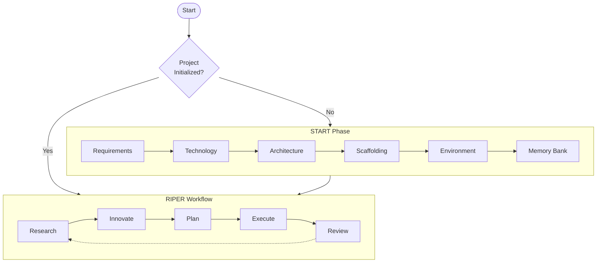

# CursorRIPER Framework

The CursorRIPER framework provides a structured approach to AI-assisted development through five specialized modes.

## The RIPER Modes

| Mode | Purpose | Example Prompt |
|------|---------|----------------|
| Research | Gather context | "Research best practices for API security" |
| Innovate | Brainstorm solutions | "Innovate approaches for user authentication" |
| Plan | Structure implementation | "Plan our task management app" |
| Execute | Write/refine code | "Implement the login feature" |
| Review | Test and improve | "Review for security vulnerabilities" |

## Workflow Process

This framework prevents unintended modifications while maintaining perfect continuity across coding sessions.

## Benefits

- **Structured approach** to AI collaboration
- **Specialized modes** for different development phases
- **Consistent workflow** across team members
- **Improved output quality** through targeted prompting

## Getting Started

1. **Identify your current development phase**
2. **Select the appropriate RIPER mode**
3. **Craft your prompt using the mode's specific language**
4. **Iterate through the modes** as your project progresses

## Resources

For more information about CursorRIPER, check out the [official repository](https://github.com/johnpeterman72/CursorRIPER).

---
The orginial RIPER framework is by: [robotlovehuman](https://github.com/robotlovehuman)

*The CursorRIPER Framework prevents coding disasters while maintaining perfect continuity across sessions.*