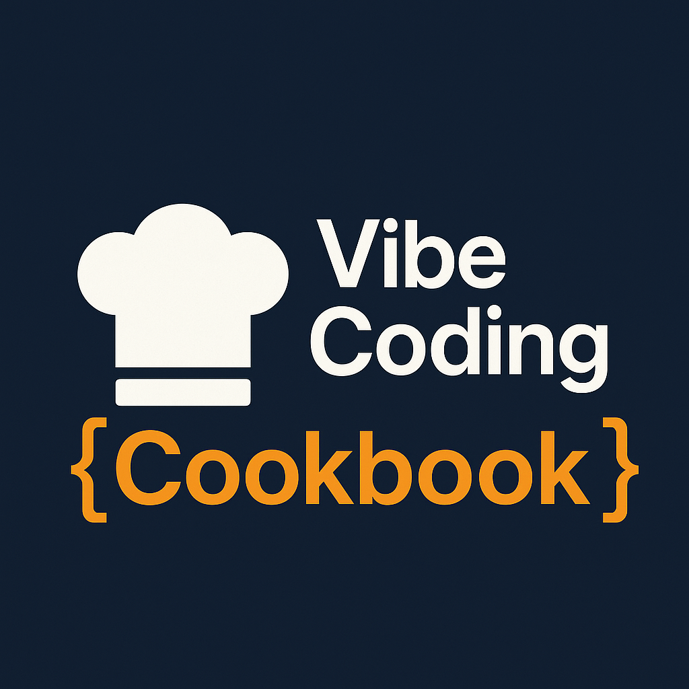

  

# 🧠 Vibe Coding Cookbook

Welcome to the **Vibe Coding Cookbook** — a practical guide for AI-assisted development teams using tools like BMAD, CursorRIPER, and vibe-tools.

...

## 🚀 Quick Start

- [Setup Environment](scripts/setup-dev-environment.sh)
- [Initialize Cookbook](scripts/setup-vibe-cookbook.sh)
- [Browse Templates](templates/)
- [Prompt Library](Shared/prompts/)

---

## 📚 What You'll Find Here

- 🔧 AI tooling integrations (BMAD, CursorRIPER, vibe-tools)
- 🧩 Modular code snippets and full-stack project templates
- 🗺️ End-to-end workflow playbooks
- ✨ Prompt engineering strategies

---

## 📂 Repository Overview

Refer to the [Folder Structure Overview](README.md#folder-structure-overview) for a breakdown of how everything fits together.

---

## 💬 Get Involved

- [File an Issue](https://github.com/jvalenzano/vibe-coding-cookbook/issues)
- [Contribute a PR](https://github.com/jvalenzano/vibe-coding-cookbook/pulls)
- Star the project to support ongoing improvements ⭐

---

